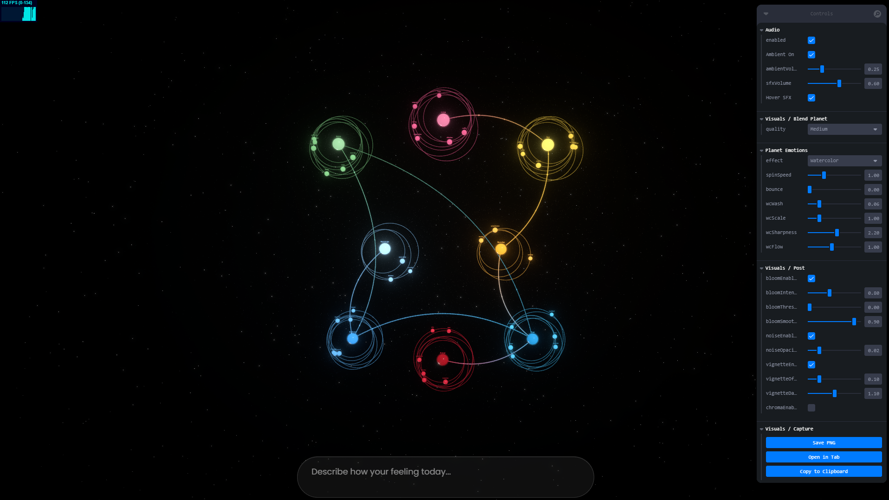

# CreativeDev: Emotion Universe [Live demo](https://labs-ai-emotion.web.app/)

Text → real-time emotional analysis → synchronized DOM + R3F visuals (planets, energy links, audio, PBR, and a Blend Planet with live shader effects: Watercolor, Oil, Link, Holographic, Voronoi).
This README keeps only the essentials; extended content lives in [docs/](docs/README.md).

## Stack (brief)

- React 19 + TypeScript + Vite 7 (SWC)
- Three.js with React Three Fiber (@react-three/fiber, @react-three/drei)
- PostFX (Bloom, Noise, Vignette, Chromatic Aberration) with a lightweight pipeline
- State: Zustand; Controls: Leva; Styling: styled-components

## Quick start

- Dev: `npm run dev`
- Build: `npm run build`
- Preview: `npm run preview`

Note: Use import.meta.env with VITE\_\* keys; do not expose the full process.env.

## Documentation

- Docs index: [docs/README.md](docs/README.md)
- Architecture: [docs/architecture.md](docs/architecture.md)
- Data contracts: [docs/data-contracts.md](docs/data-contracts.md)

## Credits

- Audio, textures, and shader techniques inspired by the R3F community and Three.js examples.
