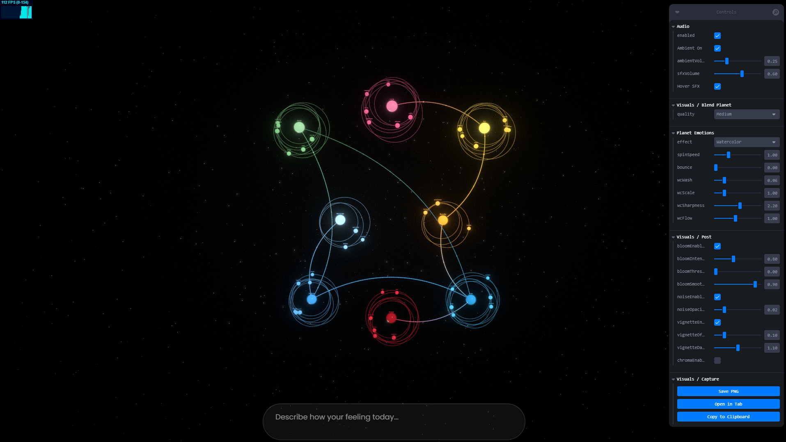

# CreativeDev: Emotion Universe · [Live demo](https://labs-ai-emotion.web.app/)

## Why this exists

Text you write becomes motion you see. This lab explores a single pipeline from text → emotion graph → synchronized DOM and WebGL visuals, with low latency and clear “why” behind every motion. The goal: expressive, explainable visuals that feel immediate and honest.

## Stack

- React 19 + TypeScript + Vite 7 (SWC; `rolldown-vite@7.1.14` override)
- React Three Fiber (@react-three/fiber, @react-three/drei), lightweight PostFX
- Zustand (state), Leva (controls), styled-components (UI)
- Validation/parsing: Zod, permissive parser utilities
- Optional OpenAI (online) + local heuristic (offline)

## Creative Goals

- Map natural language to an emotion graph and make it perceptible in <1s.
- Synchronize DOM gradients/micro-animations with R3F planets, links and the Blend Planet.
- Achieve explainability: valence/arousal drive palette, motion and particle density.
- Prove a single IA service can serve both online (OpenAI) and offline (heuristic) modes.

## What I learned

- Debounce + cancellation are crucial to avoid visual “bouncing” and perceived jank.
- One WebGL canvas keeps 60fps smoother than multiple layers; PostFX must be restrained.
- Normalizing weights and injecting cross-cluster links increases perceived cohesion.
- Biggest fail: stale README paths; fixed by aligning docs to current codebase and contracts.

## Roadmap

- v1: Unified IA pipeline (`services/EmotionServiceFactory.ts`), `scene/r3f/ClustersScene.tsx`, DOM visualizer, Leva hooks.
- v1.5: Export (PNG/short MP4), URL-shareable presets, first audio-reactivity pass.
- v2: Rich multi-emotion blending (RuleEngine-driven), preset editor, collaborative sharing.

## Creative Manifesto

This lab has a creative manifesto → [MANIFESTO.md](docs/MANIFESTO.md)

---

Key implementation references (kept short, see `docs/` for deep dive):

- Input to analysis: `features/prompt/PromptInput.tsx` → `hooks/useEmotionCoordinator.ts` (350–450ms debounce + AbortController)
- IA Service: `services/EmotionServiceFactory.ts` selects `services/OpenIAAdapter.ts` (online) or `ai/local-emotions.ts` (offline)
- Mapping: `data/mappers.ts` → `{ emotions, links }` → `state/universe.store.ts`
- DOM visuals: `scene/dom/Vizualizer.tsx` + `config/emotion-presets.ts`
- R3F: `scene/r3f/R3FCanvas.tsx` + `scene/r3f/ClustersScene.tsx` (planets/orbits/links + Blend Planet)
- Config/env: `src/config/config.ts`, `env_template` (use `import.meta.env.VITE_*`)
