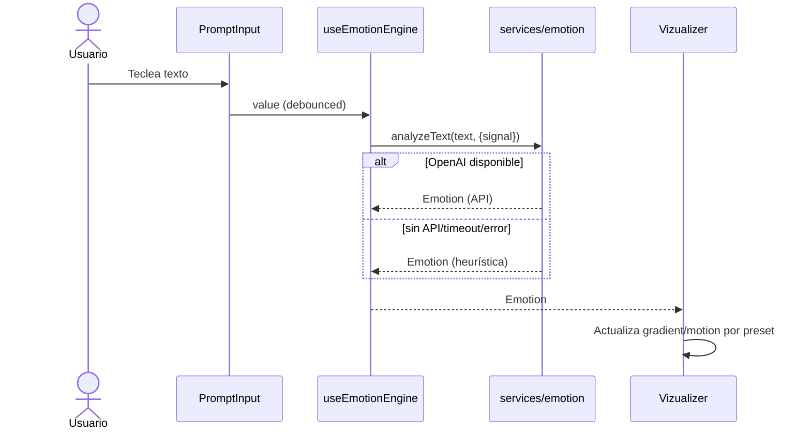

# Arquitectura de creativedev.ai-emotion

Esta app convierte texto en visuales reactivos según la emoción detectada. Se prioriza simplicidad, performance y capacidad de iteración rápida.

## Tecnologías base

- React 19 + TypeScript
- Vite (plugin React SWC)
- Framer Motion para micro-animaciones DOM
- styled-components para estilos

## Visión y flujo de datos

1) Usuario escribe en el input.
2) Hook `useEmotionEngine` debounced invoca `services/emotion.analyzeText` (OpenAI si hay credenciales; heurística local si no).
3) El resultado `Emotion` alimenta el `Vizualizer`, que usa un preset visual por emoción (colores, movimiento, partículas).



## Contratos y módulos

- Emotion (resultado mínimo):
  - `{ label: string; score: number; valence: -1..1; arousal: 0..1 }`

- services/emotion.ts
  - `analyzeText(text, { signal }) => Promise<Emotion>`
  - Intenta OpenAI (VITE_OPENAI_API_KEY, VITE_OPENAI_BASE_URL, VITE_OPENAI_MODEL). Si falla o no hay clave, usa heurística local (regex simples de español/inglés, emojis).

- hooks/useEmotionEngine.ts
  - Debounce configurable (default 350–400ms)
  - Cancela la solicitud anterior con AbortController
  - Expone `{ emotion, analyzing, error }`

- config/emotion-presets.ts
  - Mapa emoción → preset visual
  - Ejemplos (ES/EN): alegría/joy, calma/calm, tristeza/sadness, miedo/fear, enojo/anger, nostalgia, neutral
  - `getPresetForEmotion(label)`

- scene/dom/Vizualizer.tsx
  - Recibe `{ emotion, analyzing }`
  - Aplica gradient y micro-movimiento con Framer Motion según el preset

- ui/components/Canvas.tsx
  - Orquesta la animación de intro, el PromptInput controlado, loader de “Leyendo tu tono…” y renderiza el Vizualizer con la emoción actual

## Estructura de carpetas relevante

```text
src/
  services/
    emotion.ts           # Servicio de análisis (OpenAI + heurística)
  hooks/
    useEmotionEngine.ts  # Debounce + Abort + estado de análisis
  config/
    emotion-presets.ts   # Mapeo emoción → preset visual
  scene/
    dom/
      Vizualizer.tsx     # Visualizador DOM (gradients + micro-motion)
  ui/
    components/
      Canvas.tsx         # Orquestación UI (input + loader + vizualizer)
    styles/              # styled-components y utilidades
```

## Variables de entorno

- Se usan variables `VITE_*` (expuestas por Vite a `import.meta.env`):
  - `VITE_OPENAI_API_KEY`
  - `VITE_OPENAI_BASE_URL` (opcional; default `https://api.openai.com/v1`)
  - `VITE_OPENAI_MODEL` (opcional; default `gpt-4o-mini`)
- Nota: Evitamos exponer `process.env` completo. Si agregas nuevas claves, prefija con `VITE_`.

## Decisiones y trade-offs

- Sin DI/arquitecturas complejas: se favorece un servicio único y un hook para velocidad de iteración y claridad.
- Heurística local: garantiza un UX robusto sin depender siempre de la red; perfecta para POC y fallback.
- DOM primero: el Vizualizer DOM es el MVP. Una capa R3F/Canvas se puede añadir como servicio paralelo para partículas y shaders.

## Extensiones futuras (roadmap)

- Capa de partículas: un solo canvas por preset (densidad/dirección según `particles`).
- Interpolación continua: mapear (valence, arousal) a presets y animar transiciones suaves.
- Accesibilidad: respetar `prefers-reduced-motion` y ajustar densidad/velocidades.
- Telemetría: medir tiempos de análisis, FPS y errores de red.

## Performance (resumen práctico)

- Animar solo `transform` y `opacity`; declara `will-change`. Evitar repaints grandes.
- Evitar actualizar estado React cada frame; usar Framer Motion y MotionValues.
- Canvas/WebGL: un solo layer, `requestAnimationFrame` con delta time, cap de partículas por dispositivo.

## Cómo probar

```powershell
npm run dev     # desarrollo con HMR
npm run build   # build de producción
npm run preview # servidor local de preview
```

## Cómo extender

- Añadir nueva emoción: actualizar heurística en `services/emotion.ts` y su preset en `config/emotion-presets.ts`.
- Cambiar proveedor de IA: modificar solo `services/emotion.ts` manteniendo el contrato `Emotion`.
